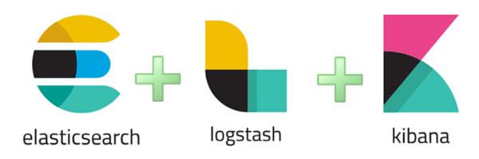
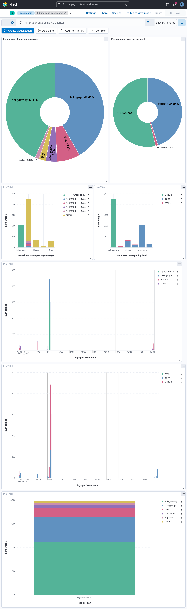

# ELK stack



## Description: 
- The ELK stack comprises three powerful open-source tools: Elasticsearch, Logstash, and Kibana. Together, these tools enable users to efficiently collect, search, analyze, and visualize large volumes of log data in real-time. This integration helps users gain deeper insights into their logs, detect anomalies, and visualize data for better understanding and decision-making.
### Key Features:
- Elasticsearch: A distributed, RESTful search and analytics engine designed for scalability and real-time search capabilities. It stores and indexes data to enable fast and flexible searching.
- Logstash: A server-side data processing pipeline that ingests, transforms, and enriches data from multiple sources before sending it to Elasticsearch. It facilitates centralized log management and prepares data for analysis.
- Kibana: An intuitive visualization and exploration tool that works seamlessly with Elasticsearch. It allows users to create dynamic dashboards, charts, and graphs to visualize data trends, monitor metrics, and perform ad-hoc analysis.
## Table of Contents
- [Install Logstash](#Logstash)
- [Install Elasticsearch](#Elasticsearch)
- [Install Kibana](#Kibana)
- [Import/Export Kibana dashboards](#Dashboards)
- [Enable SSL](#Enable-SSL)

## Logstash
Starting with the logging driver that forwards Docker container logs to Logstash, I use GELF (Graylog Extended Log Format). GELF addresses the limitations of classic plain syslog by offering a format that supports longer payloads like backtraces, includes structured data types to differentiate between numbers and strings, and provides a standardized approach across various syslog dialects, while also supporting compression.
- Simply add this to every service container from which we want to gather logs (Fix Logstash IP in the stack network in Docker compose):
``` YAML
    logging:
      driver: gelf
      options:
        gelf-address: "udp://<Logstash container IP>:12201"
```
- And in Logstash conf file we should specify the input :
``` C
input {
  gelf {
    port => 12201
  }
}
```
- It's time to filter the logs by removing unnecessary fields and translating some fields. In my case, the log level in GELF is represented as an integer and not accurate that needs to be translated into an accurate string for better readability and analysis.
``` C
filter {
  if [message] =~ /ERROR/ {
    mutate {
      add_field => { "log_level" => "ERROR" }
    }
  }
  else if [message] =~ /WARN/ {
    mutate {
      add_field => { "log_level" => "WARN" }
    }
  }
  ...  
}

```
- Now we configure the input and filter sections for Logstash. Next, we will add the output configuration to redirect the log data to Elasticsearch for indexing and storage. This involves specifying the Elasticsearch host, port, user credentials, password, and the certificate authority (CA) used for authenticating content from Elasticsearch, as generated [here](#TLS/SSL). Additionally, we define the index pattern for storing log data based on the logs' timestamp (e.g., daily indexing).
``` C
output {
  elasticsearch {
    hosts => ["https://elasticsearch:9200"]
    user => "elastic"
    password => "${ELASTIC_PASSWORD}"
    index => "logs-%{+YYYY.MM.dd}"
    ssl => true
    cacert => "/usr/share/logstash/config/certs/ca/ca.crt"
  }
}
```
- Finally, we configure the `logstash.yml` file by specifying the `http.host` and `http.port` settings.
## Elasticsearch
- Configuring `elasticsearch.yml` involves specifying a single-node setup and defining the network host the server should listen on. Additionally, creating a Docker volume bound to `/usr/share/elasticsearch/data` ensures persistent data retention. Enabling SSL involves specifying the certificate, key, and CA generated [here](#TLS/SSL).
## Kibana
- Similar to other services, the `kibana.yml` file should be configured to specify the server's host and port, Elasticsearch connection details including host, user, password, and CA, and enable SSL with the appropriate certificate and key for secure communication between the browser and Kibana server.
#### Dashboards
- After creating and customizing your dashboard in Kibana based on log data `Analytics > Dashboards > Create dashboard`, you can import and export it (as JSON file) later without losing any configurations or visualizations (https://www.elastic.co/guide/en/kibana/current/dashboard-api.html).
## Enable SSL
Firstly we should generate a CA (certificate authority) and two certificates with their private keys using `elasticsearch-certutil` that provided in elasticsearch container, that's why we create another elasticsearch container for generating the certificates 
``` bash
bin/elasticsearch-certutil cert --silent --pem -out config/certs/certs.zip --in config/certs/instances.yml --ca-cert config/certs/ca/ca.crt --ca-key config/certs/ca/ca.key;
```
and also for changing the kibana_system user password in elasticsearch (you should the elastic user in kibana authentication because The kibana_system is a built-in role used to connect to Elasticsearch. It's not intended as a login to Kibana)
``` bash
curl -s -X POST --cacert config/certs/ca/ca.crt -u "elastic:${ELASTIC_PASSWORD}" -H "Content-Type: application/json" https://elasticsearch:9200/_security/user/kibana_system/_password -d "{\"password\":\"${KIBANA_PASSWORD}\"}"
```
and add kibana dashboard.
``` bash
curl -s --cacert config/certs/ca/ca.crt -X POST "https://kibana:5601/api/kibana/dashboards/import?exclude=logs-*" -H "Content-Type: application/json" -H "kbn-xsrf: true" -d @/usr/share/elasticsearch/dashboard1.json -u "elastic:${ELASTIC_PASSWORD}" 
```

## Useful links:
- https://www.youtube.com/watch?v=Hqn5p67uev4
- https://www.elastic.co/guide/en/elasticsearch/reference/8.14/docker.html
- https://www.elastic.co/guide/en/elasticsearch/reference/8.14/certutil.html
- https://www.elastic.co/guide/en/kibana/8.14/docker.html
- https://www.elastic.co/guide/en/kibana/current/create-a-dashboard-of-panels-with-web-server-data.html
- https://www.elastic.co/guide/en/kibana/current/dashboard-api.html
- https://www.elastic.co/guide/en/kibana/current/configuring-tls.html

Example of a Kibana dashboard:



